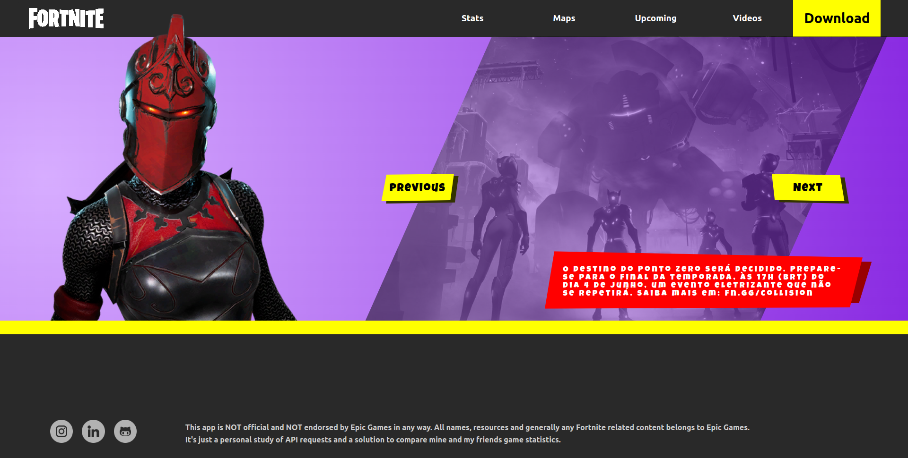
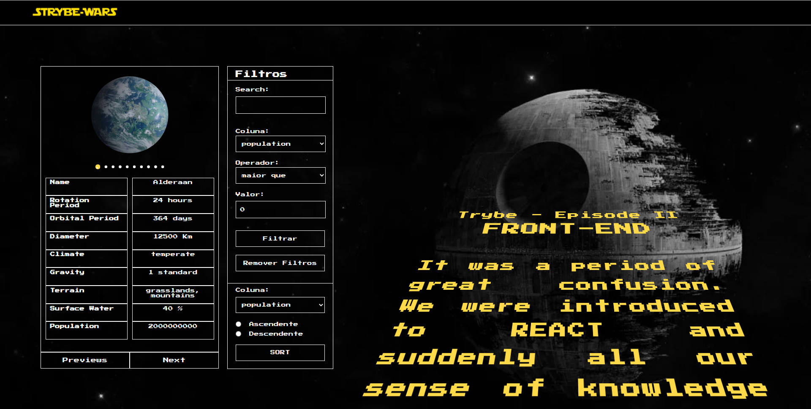
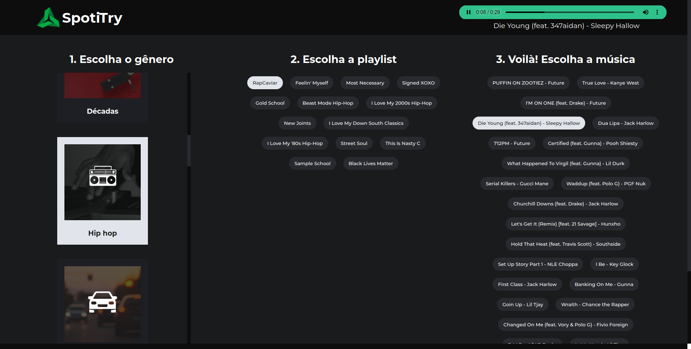
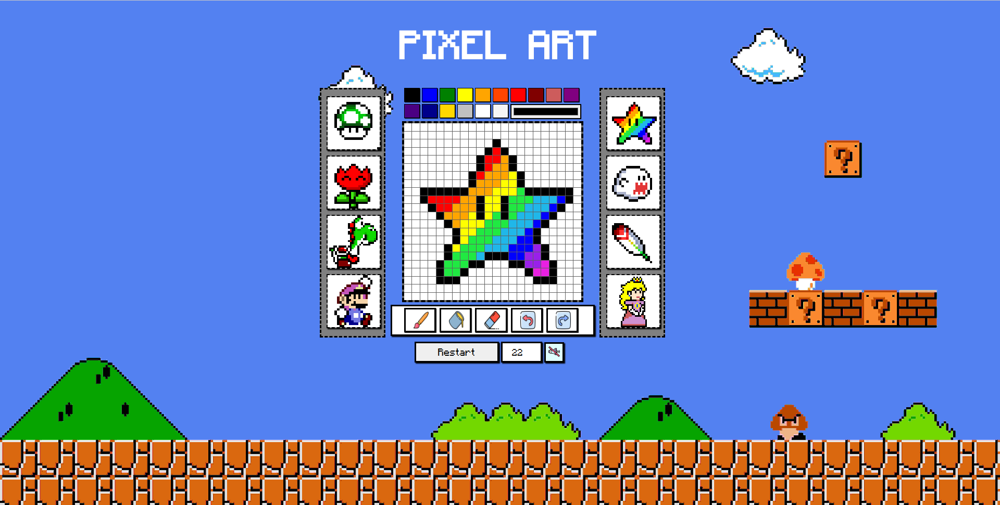

Wasup! :v: I am Gustavo Santos!!
================================

I'm a Software Engineer.
----------------------------------------------------

I'm a freelancer software engineer with a passion for all tech things. My favorite programming language is JavaScript, but I'm also proficient in Java, TypeScript and Python. I have experience working with both React and NodeJS, and enjoy exploring new technologies and frameworks to build innovative applications.

In my free time, you'll find me tinkering with new tech gadgets, attending hackathons and sometimes (or a lot) playing Fortnite. I'm a big believer in the power of open source and actively looking for contribute to projects on GitHub.

If you're interested in collaborating on a project or just want to chat about the latest tech trends, feel free to reach out. Let's build something great together!

* 🌍  I'm based in Pernambuco - Brazil.
* :email:  You can contact me at [gugasantos.dev@gmail.com](mailto:gugasantos.dev@gmail.com)
* 🧠  Right Now i'm on an imersive NodeJS training with Erick Wendel called JSExperts!
* 🎓 Currently in my first year of college studying system analysis and development.
* 🚀 Also, I'm participating in a Java acceleration program at Trybe.Inc.
* 🤝  Open to collaborating on all kind of Projects!
* ⚡  I can learn fast if you teach me slowly!
* :octocat: Follow me on LinkedIn: https://www.linkedin.com/in/gugasantos/

----------------------------------------------------

### Skills

  
  
  
  
  
  
  
  
  
  
  
  
  
  
  
  
  
  
  
  
  
  
  
  
  

###

### My Socials

     

### Badges

<b>My GitHub Stats</b>

<h1 align="center">Some Personal Projects</h1>

<table>
  <tr>
    <td valign="top" width="500px">
      <h2 align="center"><a href="https://github.com/Guga-Santos/fortinite-app-full">Fortnite-Stats</a></h2>
      
       
       
    </td>
    <td valign="top" width="500px">
      <h2 align="center"><a href="https://github.com/Guga-Santos/shopping-cart">Shopping-Cart</a></h2>
      
       
       
    </td>
  </tr>
  <tr>
    <td valign="top" width="500px">
      <h2 align="center"><a href="https://github.com/Guga-Santos/Starwars-search-trybe">StarWars Planets</a></h2>
      
       
       
    </td>
    <td valign="top" width="500px">
      <h2 align="center"><a href="https://github.com/Guga-Santos/TrybeWallet-app">Trybe Wallet</a></h2>
      
       
       
    </td>
  </tr>
  <tr>
    <td valign="top" width="500px">
      <h2 align="center"><a href="https://github.com/Guga-Santos/SpotiTry">SpotiTrybe</a></h2>
      
       
       
    </td>
    <td valign="top" width="500px">
      <h2 align="center"><a href="https://github.com/Guga-Santos/Guga-Santos.github.io">Pixel Art</a></h2>
      
       
       
    </td>
  </tr>
  
</table>
 

### Trophies

